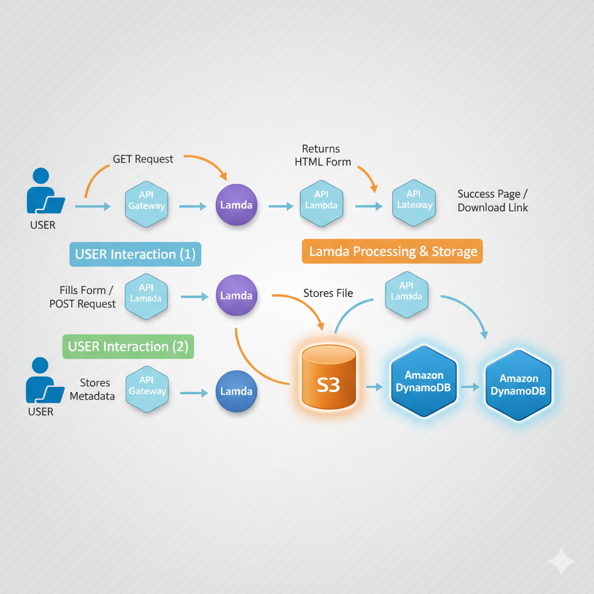
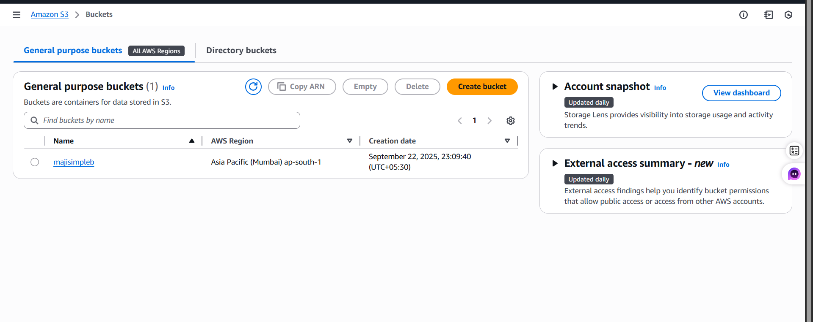
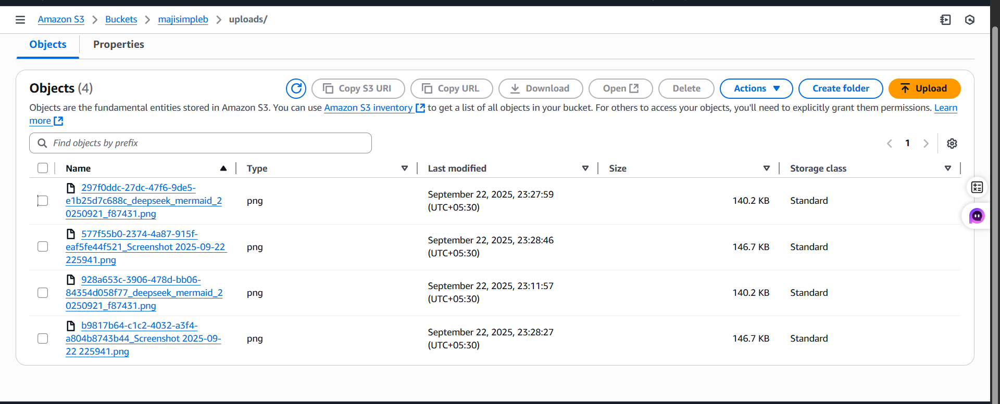
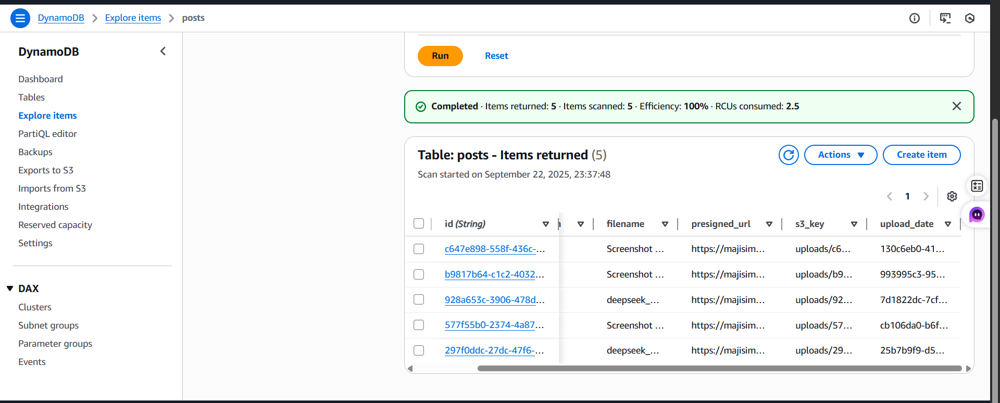
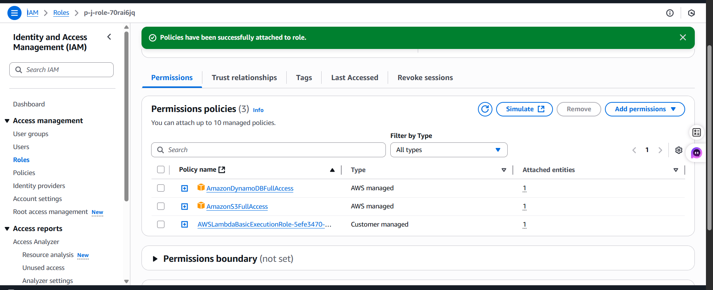
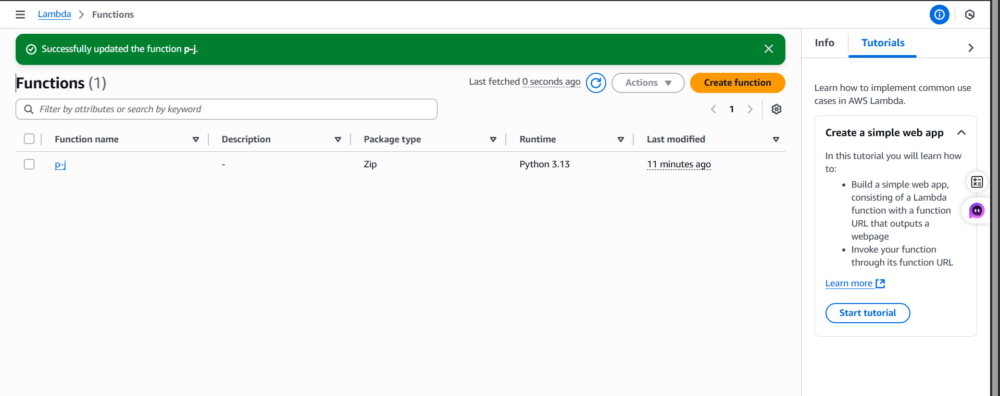
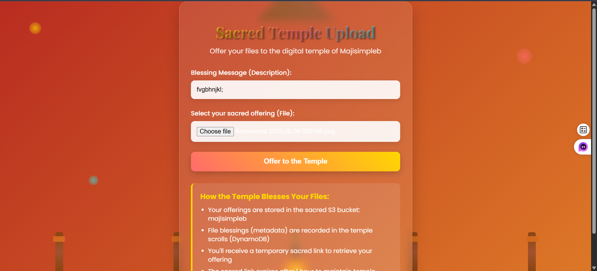
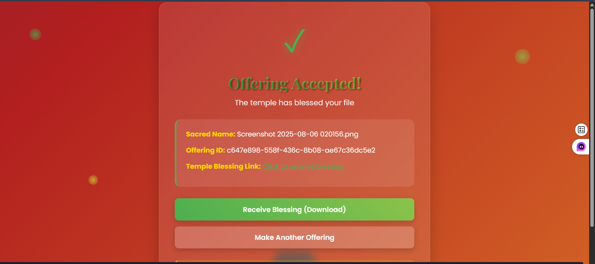

# project--Serverless-application--Sacred-Temple-File-Uploader
<br>
<h2>Quick Overview to Understand The Flow</h2>
<h4>1. Create lambda function.<br>
2. Create bucket in S3.<br>
3. Create Dyanomodb DB.<br>
4. In lambada function develope(create) a sutable code for project & deploy.<br>
5. You will need to create a library for creating layer. To do this, go to Lambadaa → Layers → Create Layers.<br>
6. Now scroll down in the same Lambda function where you wrote the code. There you’ll see an Add Layer option — use it to add the layer you created.<br>
7. Add IAM roles suitable for your project.(to do that =lambda function ->conf ->edit conf -> scroll down ->click iam role link ->give suitable permissions.<br>
8. create url and copy pest the brouser ..here will you go ..your serverless project run.<br></h4>

<br>
<h3>A beautiful temple-themed file upload system built with AWS Lambda. Users can upload files to S3 bucket with an immersive spiritual experience. The application features animated temple design, floating elements, and sacred-themed UI.</h3>

## Features

- 🏯 Temple-inspired animated design with floating elements
- 📁 Secure file upload to AWS S3 bucket
- 💾 Metadata storage in DynamoDB table
- 🔗 Auto-generated presigned URLs for file access
- 📱 Fully responsive design for all devices
- ⏳ 1-hour temporary download links for security

## Tech Stack

- **Backend**: AWS Lambda (Python)
- **Storage**: AWS S3 (majisimpleb bucket)
- **Database**: AWS DynamoDB (posts table)
- **Frontend**: HTML5, CSS3, JavaScript
- **Styling**: Custom CSS with animations

# 🌐 Architecture Overview

## **High-Level Design**


---

## **AWS Components and Purpose**

| **Component**      | **AWS Service**       | **Description / Purpose**                                                                 |
|--------------------|-----------------------|-------------------------------------------------------------------------------------------|
| 🗂 **File Storage** | **Amazon S3**         | Secure, scalable storage for user-uploaded files and static assets.                        |
| ⚡ **Compute**      | **AWS Lambda**        | Serverless backend for processing file uploads and triggering workflows automatically.     |
| 📊 **Database**    | **Amazon DynamoDB**   | NoSQL database to store file metadata and user access details with high performance.      |
| 🔐 **Security**    | **AWS IAM Policies**  | Manages permissions and access control for secure interactions between services.          |

---

## **Workflow Summary**
1. **User Uploads a File** → Through an API endpoint.
2. **API Gateway** → Routes request securely to **AWS Lambda**.
3. **Lambda Function** → Validates, processes, and uploads file to **Amazon S3**.
4. **DynamoDB** → Stores metadata like file name, timestamp, and user details.
5. **Lambda → API Gateway → User** → Returns a **success response** with a **download link**.

---

# ⚙️ 2. AWS Services Configuration

## **2.1 Amazon S3 Bucket Setup**

The **S3 bucket** will be used for **secure file storage**, enabling temporary access links with expiration policies to ensure data privacy and controlled sharing.

---

### 📝 **Configuration Details**

| **Setting**          | **Value**                             | **Purpose**                                                     |
|----------------------|---------------------------------------|-----------------------------------------------------------------|
| **Bucket Name**       | `majisimpleb`                         | Unique name for storing uploaded files.                         |
| **Region**           | `ap-south-1` *(Asia Pacific - Mumbai)* | Low-latency storage close to target users.                      |
| **Access Control**    | **Private** (Default)                  | Prevents public access to files by default.                     |
| **Temporary URL**     | **Enabled** via pre-signed URLs        | Provides time-limited secure access to specific files.           |
| **Lifecycle Policy**  | **Enabled**                            | Automatically manages file expiration and cleanup.               |

---

### 🚀 **Step-by-Step Setup Guide**

1. **Open AWS Console** → Navigate to **S3 Service**.  
2. **Click “Create Bucket”**.  
3. Enter the **Bucket Name**:  
   - `majisimpleb`  
4. Select **Region**:  
   - `ap-south-1 (Asia Pacific - Mumbai)`  
5. **Uncheck "Block All Public Access"** *(if using pre-signed URLs)*.  
6. **Enable Bucket Versioning** *(recommended for file recovery)*.  
7. Click **Create Bucket** to finalize.  
8. Configure **Bucket Policies** and **IAM Roles** to restrict access.  

---

### 📸 **Visual Reference**



---
## **2.2 Amazon DynamoDB Table Setup**

The **DynamoDB table** is designed to store **file metadata**, allowing secure tracking of files, managing expiration policies, and generating download statistics.  
It is **serverless, highly scalable**, and automatically adapts to incoming traffic.

---

### 📝 **Configuration Details**

| **Setting**          | **Value**                | **Purpose**                                                                 |
|----------------------|--------------------------|-----------------------------------------------------------------------------|
| **Table Name**       | `lambda`                 | Stores metadata for uploaded files.                                         |
| **Partition Key**    | `id (String)`            | Unique identifier for each file.                                           |
| **Capacity Mode**    | `On-Demand`              | Automatically scales read and write capacity as needed.                      |
| **Encryption**       | **AWS Managed Key (KMS)** | Ensures data is encrypted at rest for security.                              |
| **Backup**           | **Point-in-Time Recovery**| Enables data restoration at any point in the last 35 days.                   |

---

### 📂 **Data Stored in DynamoDB**

Each record in the table stores important metadata:

| **Field**            | **Type**   | **Description**                                    |
|----------------------|------------|----------------------------------------------------|
| `id`                 | String     | Unique file identifier.                            |
| `original_filename`  | String     | The actual name of the file uploaded by the user. |
| `upload_timestamp`   | String     | Exact time the file was uploaded.                  |
| `expiration_time`    | String     | Defines when the file should expire and be deleted.|
| `s3_object_reference`| String     | Direct reference to the S3 object key.            |
| `download_count`     | Number     | Tracks how many times the file has been downloaded.|

---

### 🚀 **Step-by-Step Setup Guide**

1. **Open AWS Console** → Navigate to **DynamoDB Service**.  
2. Click **Create Table**.  
3. Configure basic settings:  
   - **Table Name:** `lambda`  
   - **Partition Key:** `id (String)`  
4. Under **Capacity Mode**, select **On-Demand**.  
5. Enable **Encryption** using **AWS Managed Key (KMS)**.  
6. (Optional) Turn on **Point-in-Time Recovery** for backups.  
7. Click **Create Table** to finalize.  

---

### 📸 **Visual Reference**

| **S3 Bucket (Storage)**        | **DynamoDB (Metadata)**            |
|--------------------------------|------------------------------------|
|  |  |

---

## **2.3 IAM Policies and Roles**

The **IAM Role** ensures that the **AWS Lambda function** securely interacts with **S3** and **DynamoDB** without exposing credentials.  
It follows the **least privilege principle**, granting only the required permissions.

---

### 📝 **Configuration Details**

| **Setting**         | **Value**                      | **Purpose**                                                    |
|---------------------|--------------------------------|----------------------------------------------------------------|
| **Execution Role**  | `AWSLambdaBasicExecutionRole`  | Base role for Lambda to run securely and log to CloudWatch.    |
| **Managed Policy #1** | `AmazonS3FullAccess`           | Allows Lambda to read/write objects in Amazon S3.              |
| **Managed Policy #2** | `AmazonDynamoDBFullAccess`      | Allows Lambda to create, read, update, and delete DynamoDB data.|

---

### 🔐 **Purpose of IAM Role**

| **Component**      | **Access Granted**                  | **Why It's Needed**                                     |
|--------------------|-------------------------------------|-------------------------------------------------------|
| **Lambda → S3**    | Read / Write                        | Upload, retrieve, and delete files in the bucket.     |
| **Lambda → DynamoDB** | Full CRUD (Create, Read, Update, Delete) | Manage file metadata efficiently.                      |
| **Lambda → ** | Logs & Monitoring                  | Monitor Lambda execution and debug errors.            |

---

### 🚀 **Step-by-Step Setup Guide**

1. **Open AWS Console** → Navigate to **IAM Service**.  
2. Click **Roles** → **Create Role**.  
3. **Choose Trusted Entity:**  
   - **AWS Service** → Select **Lambda**.  
4. **Attach Managed Policies:**
   - `AWSLambdaBasicExecutionRole` *(for logging)*  
   - `AmazonS3FullAccess` *(for S3 bucket operations)*  
   - `AmazonDynamoDBFullAccess` *(for DynamoDB access)*  
5. **Review and Create Role.**  
6. Assign this role to your **Lambda function** under its configuration settings.

---

### 📸 **Visual Reference**

| **IAM Role Diagram** |
|----------------------|
|  |

---
# 🔄 3. Application Workflow

The application follows a **serverless file management flow**, ensuring secure file uploads, metadata tracking, and time-limited download access.

---

## **📂 File Upload Process**

| **Step** | **Action**                      | **AWS Service Involved**         | **Outcome**                                      |
|----------|----------------------------------|-----------------------------------|-------------------------------------------------|
| **1️⃣**  | **User Interface**               | Web App (HTML, CSS, JS)           | User selects a file using a secure web form.    |
| **2️⃣**  | **Lambda Trigger**               | AWS Lambda                         | API Gateway sends file data to Lambda for processing. |
| **3️⃣**  | **S3 Storage**                    | Amazon S3                           | File is stored securely with a unique identifier. |
| **4️⃣**  | **Metadata Recording**           | Amazon DynamoDB                      | File details (ID, timestamp, name, etc.) are saved. |
| **5️⃣**  | **URL Generation**               | AWS Lambda + S3                     | A **pre-signed URL** is generated with a **1-hour expiration**. |
| **6️⃣**  | **User Feedback**                | API Gateway → Web App               | User receives a **success message** with a secure download link. |

---

### 🚀 **Workflow in Action**

1. **User selects file** and clicks **Upload**.  
2. **API Gateway** sends the file data to **AWS Lambda**.  
3. **Lambda**:
   - Generates a unique file ID.
   - Uploads the file to **Amazon S3**.
   - Saves metadata in **DynamoDB**.
4. **Lambda generates a pre-signed URL** (valid for 1 hour).  
5. **Response sent back to the user** with:
   - File download link  
   - Upload confirmation message

---

# 🛡️ 4. Temporary URL Mechanism

Secure file sharing is achieved using **pre-signed S3 URLs** with **1-hour expiration**, ensuring files are never publicly exposed.

| **Feature**                  | **Purpose**                                        |
|------------------------------|----------------------------------------------------|
| ⏳ **1-Hour Expiration**      | Limits link validity to prevent unauthorized access. |
| 🔒 **No Public Access**       | Files remain private inside the S3 bucket.          |
| 🚀 **Secure Sharing**         | Shareable only via temporary links generated by Lambda. |
| ♻️ **Auto Cleanup**           | Expired links and files are automatically removed.   |

---

# 🔐 5. Security Features

Ensuring data privacy, controlled access, and system reliability through **AWS security best practices**.

---

## **5.1 Access Control**

| **Control**                     | **Implementation**              |
|---------------------------------|---------------------------------|
| 🧑‍💻 **IAM Roles**                | Least privilege permissions for Lambda. |
| 🚫 **No Public S3 Access**        | Bucket is private by default. |
| 🗂 **Granular DynamoDB Policies** | Fine-grained access controls on metadata. |

---

## **5.2 Data Protection**

| **Feature**                     | **Benefit**                                    |
|--------------------------------|------------------------------------------------|
| ⏳ **Temporary URLs**            | Secure, time-limited access to files.         |
| 🔒 **No Persistent Public Links**| Prevents permanent exposure of data.          |
| 🗄 **Secure Metadata Storage**   | Sensitive metadata stored safely in DynamoDB. |

---

## **5.3 Monitoring & Logging**

| **Service**          | **Logging Purpose**                                  |
|----------------------|------------------------------------------------------|
| 📂 **S3 Access Logs** | Records all file access activities.                  |
| 🔍 **DynamoDB Logs**  | Monitors query and data access patterns.             |

---

## 6.1 Deployment Steps

## 1. Infrastructure Setup

## Create S3 bucket
`aws s3api create-bucket --bucket majisimpleb --region ap-south-1`

## Create DynamoDB table
`aws dynamodb create-table` \
    --`table-name lambda \`
    --`attribute-definitions AttributeName=id,AttributeType=S \`
    --`key-schema AttributeName=id,KeyType=HASH \`
    --`billing-mode PAY_PER_REQUEST`


## 6.2 IAM Role Configuration
```bash

{
  "Version": "2012-10-17",
  "Statement": [
    {
      "Effect": "Allow",
      "Action": [
        "s3:PutObject",
        "s3:GetObject",
        "s3:DeleteObject"
      ],
      "Resource": "arn:aws:s3:::majisimpleb/*"
    },
    {
      "Effect": "Allow",
      "Action": [
        "dynamodb:PutItem",
        "dynamodb:GetItem",
        "dynamodb:UpdateItem",
        "dynamodb:DeleteItem"
      ],
      "Resource": "arn:aws:dynamodb:ap-south-1:*:table/lambda"
    }
  ]
}
````
# ⚡ 5.3 Lambda Function Deployment

The **Lambda function** handles file upload events, storing files in **S3**, metadata in **DynamoDB**, and generating **temporary download URLs**.

---

### 🖥️ **Configuration**

| **Setting**             | **Value / Description**                      |
|--------------------------|---------------------------------------------|
| **Runtime**             | Python 3.9 / Node.js 16.x                   |
| **Handler**             | Processes upload events from API Gateway    |
| **Environment Variables** |                                               |
|                          | `S3_BUCKET=majisimpleb`                       |
|                          | `DYNAMODB_TABLE=lambda`                      |
|                          | `URL_EXPIRATION=3600` *(1 hour in seconds)* |

---

### 📂 **Lambda File Overview**

- Contains the **main logic** for:  
  - Validating uploaded files  
  - Storing files in **S3 bucket**  
  - Recording metadata in **DynamoDB**  
  - Generating **pre-signed URLs** for secure downloads

---

### 📸 **Visual Reference**



---

## Upload Success





## Stored Data in S3


## Stored Data in DynamoDB


# 📦 Usage Instructions

Follow these steps to securely upload and share files using the **Serverless Info Uploader**:

1. **Access the Upload Portal**  
   Open the web interface in your browser.

2. **Select File**  
   Choose the file to upload using the file picker.

3. **Initiate Upload**  
   Click the **"Upload File"** button.

4. **Receive Link**  
   Copy the temporary download link generated after successful upload.

5. **Share Securely**  
   Distribute the link only with intended recipients.

> **Note:** Download links automatically expire after **1 hour** for security.

---

# 💰 Cost Optimization

- **Pay-per-use Pricing:** Only pay for actual service usage.  
- **Serverless Architecture:** No idle resource costs.  
- **Automatic Scaling:** Handles varying workloads seamlessly.  
- **Zero Maintenance:** No need to manage servers or infrastructure.  

---

# 📝 Project Summary

The **Serverless Info Uploader** is a **secure, scalable, and fully serverless file upload solution** built on AWS. It showcases modern **cloud architecture patterns**, including:

- **Event-driven processing:** AWS Lambda handles uploads automatically.  
- **Managed services:** S3 for storage and DynamoDB for metadata ensure reliability.  
- **Secure access:** IAM policies enforce least-privilege access.  
- **Cost-efficiency:** Pay-per-use model with automatic scaling.  

By combining **S3, Lambda, DynamoDB, and IAM**, this solution provides a **highly available, maintainable, and secure file upload service** without server management.  

> **Best Practices Implemented:**  
> - Proper security configurations  
> - Error handling  
> - Cost optimization  
> - Seamless user experience for secure file sharing

